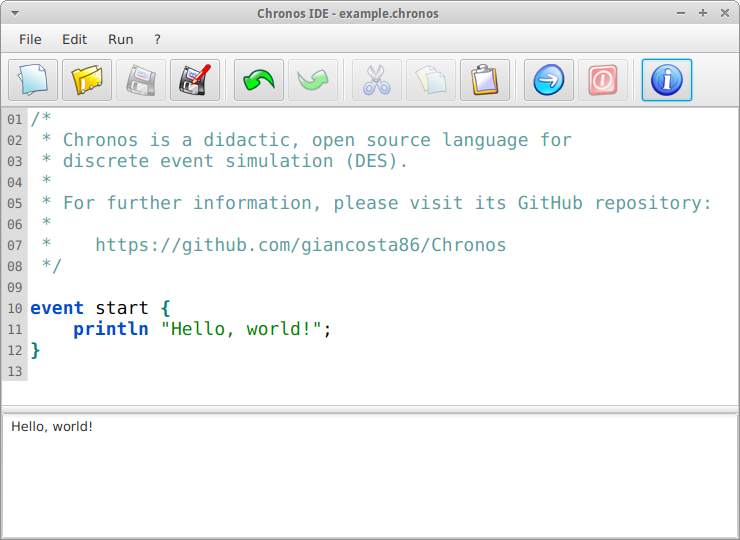

# Chronos IDE

*Integrated development environment for the Chronos programming language*

## Introduction

*Chronos IDE* is a user-friendly IDE (integrated development environment) for the [Chronos programming language](https://github.com/giancosta86/Chronos).

## Requirements

Chronos IDE requires Java 8 update 51 or later compatible version.

## Download and run

The easier, suggested way to execute Chronos IDE is via [MoonDeploy](https://github.com/giancosta86/moondeploy): just go to the [download area](https://github.com/giancosta86/Chronos-IDE/releases/latest) and open *App.moondeploy* to automatically download and execute the application.

The latest binary package can be downloaded [from GitHub](https://github.com/giancosta86/Chronos-IDE/releases/latest).

The executable program - for both Unix and Windows - is in the *bin* subdirectory.

In case of problems while starting up the application, please check your Java version and your [JAVA_HOME environment variable](http://docs.oracle.com/cd/E19182-01/820-7851/inst_cli_jdk_javahome_t/index.html): starting the program from the command line should also print out a detailed error description.

## Further references

Chronos IDE is based on [OmniEditor](https://github.com/giancosta86/OmniEditor), a JavaFX library encapsulating a fully-functional, customizable IDE for programming languages.

Chronos IDE also employs the [Chronos](https://github.com/giancosta86/Chronos) engine.

All the *special thanks* mentioned in the related README files apply to Chronos IDE as well.

### RichTextFX - License information

>Copyright (c) 2013-2014, Tomas Mikula
>All rights reserved.
>
>Redistribution and use in source and binary forms, with or without modification, are permitted provided that the following conditions are met:
>
>1. Redistributions of source code must retain the above copyright notice, this list of conditions and the following disclaimer.
>
>2. Redistributions in binary form must reproduce the above copyright notice, this list of conditions and the following disclaimer in the documentation and/or other materials provided with the distribution.
>
>THIS SOFTWARE IS PROVIDED BY THE COPYRIGHT HOLDERS AND CONTRIBUTORS "AS IS" AND ANY EXPRESS OR IMPLIED WARRANTIES, INCLUDING, BUT NOT LIMITED TO, THE IMPLIED WARRANTIES OF MERCHANTABILITY AND FITNESS FOR A PARTICULAR PURPOSE ARE DISCLAIMED. IN NO EVENT SHALL THE COPYRIGHT HOLDER OR CONTRIBUTORS BE LIABLE FOR ANY DIRECT, INDIRECT, INCIDENTAL, SPECIAL, EXEMPLARY, OR CONSEQUENTIAL DAMAGES (INCLUDING, BUT NOT LIMITED TO, PROCUREMENT OF SUBSTITUTE GOODS OR SERVICES; LOSS OF USE, DATA, OR PROFITS; OR BUSINESS INTERRUPTION) HOWEVER CAUSED AND ON ANY THEORY OF LIABILITY, WHETHER IN CONTRACT, STRICT LIABILITY, OR TORT (INCLUDING NEGLIGENCE OR OTHERWISE) ARISING IN ANY WAY OUT OF THE USE OF THIS SOFTWARE, EVEN IF ADVISED OF THE POSSIBILITY OF SUCH DAMAGE.
